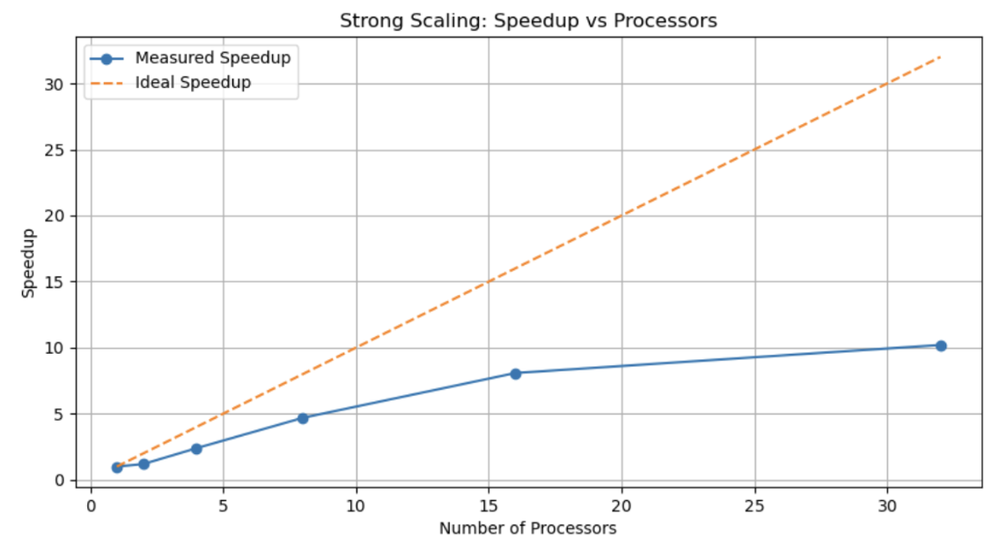
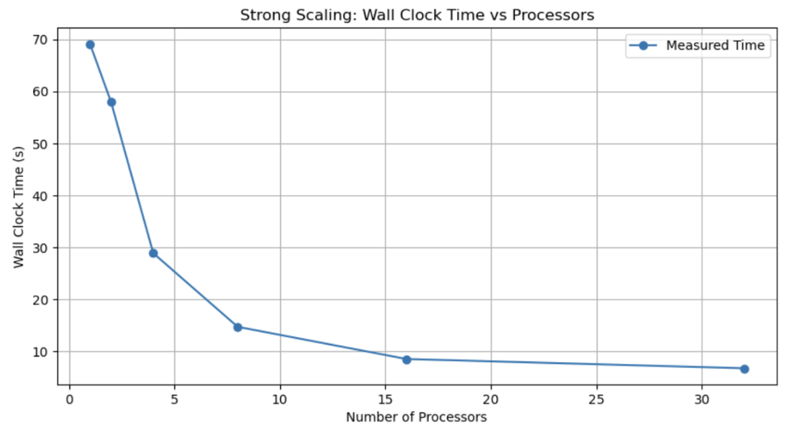
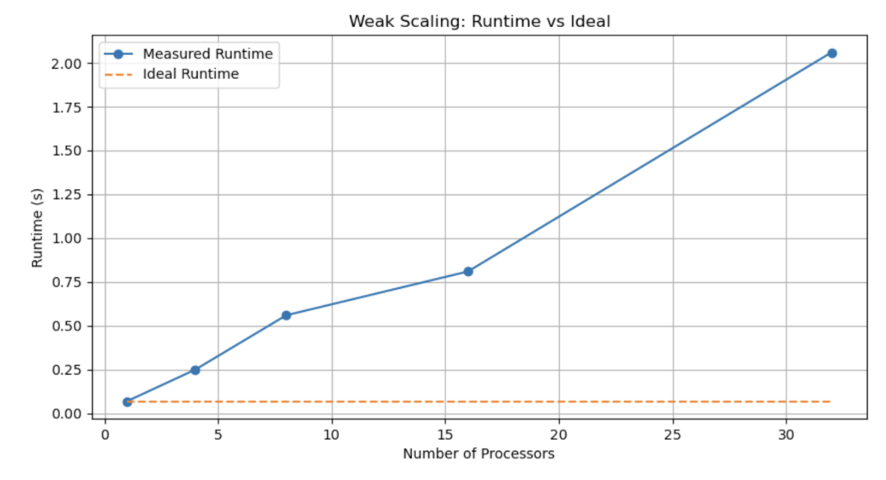

# Parallelized Diffusion Simulation Using MPI

This project implements a scalable 2D diffusion simulation using the **Message Passing Interface (MPI)** to accelerate scientific computation. The simulation models how substances diffuse over time using finite difference approximations and is designed to efficiently run on high-performance computing clusters.

---

## Features

- **Implicit Euler method** for numerical stability with larger time steps
- **Conjugate Gradient Solver** for sparse linear systems
- **Neumann (zero-flux)** boundary conditions
- **Ghost cell communication** between subgrids using `MPI_Sendrecv`
- **Strong and Weak Scaling** studies up to 64 processors
- **Profiling analysis** for performance bottlenecks

---

## Background

Diffusion is a fundamental physical process that occurs in many scientific fields, such as physics, biology, and chemistry. However, simulating diffusion over large, high-resolution grids is computationally expensive. A serial implementation becomes impractical at scale.

This project parallelizes the simulation using MPI, distributing the workload across multiple processors and significantly reducing runtime.

---

## Implementation Overview

- Discretized the 2D diffusion equation using finite difference methods.
- Used **implicit Euler** to ensure numerical stability.
- Solved the resulting linear system at each time step using the **Conjugate Gradient** method.
- Parallelized matrix-vector multiplication and grid updates with MPI.
- Used **ghost cells** and **MPI_Allreduce** for process synchronization and boundary updates.

---

## Performance

### Strong Scaling
- Fixed grid size: 1000 x 1000
- Processors: 1, 2, 4, 8, 16, 32
- Achieved near-linear speedup up to 8 processors.
- Speedup plateaus at 16+ due to communication overhead.

### Weak Scaling
- Scaled problem size with processor count.
- Runtime grows as processor count increases, due to ghost cell communication and load imbalance.

---

## Hardware & Parameters

- Tested on **Perlmutter CPU nodes** (128 cores per node)
- Diffusion coefficient: `D = 0.1`
- Time step size: `dt = 0.001`
- Iterations: `200`
- Domain size: `1.0 x 1.0`

---

## Profiling

- Major runtime bottleneck: matrix-vector product in CG solver.
- MPI profiling shows **imbalanced workload** across ranks, especially in `MPI_Allreduce` and `MPI_Sendrecv`.

## Authors

- **Thomas Cui** (zc246)
- **Bohan Yang** (by93)
- **Jingyu Xu** (jx62)
---
